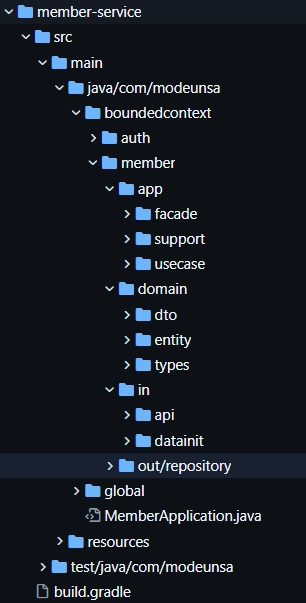

# 📂 도메인 주도 설계(DDD) 기반 디렉토리 아키텍처

각 모듈 내부는 DDD를 기반으로 다음과 같은 계층 구조를 가집니다.

## ⚙️ app
**facade와 service가 존재하는 영역입니다.**

* **`facade`**: `in`의 클래스는 `usecase`에 바로 접근할 수 없고 반드시 `facade`를 통해야 합니다.
* **`usecase`**: 비즈니스 로직을 구현하는 영역입니다. `usecase`에는 `@Transactional`이 붙여서 트랜잭션 경계를 설정합니다.

## 🧠 domain
**순수 비즈니스 로직을 구현하는 영역입니다.**

* **`entity`**: 비즈니스 규칙을 구현하는 영역입니다.
* **`policy`**: 비즈니스 규칙을 구현하는 영역입니다.
* **`types`**: 도메인 내에서 사용하는 ENUM을 모아두는 디렉토리입니다.
* **`dto`**: 계층 간 데이터를 전달할 때 사용하는 데이터 전송 객체(Data Transfer Object)가 위치하는 영역입니다.

## 📥 in
**변화의 시작점, 외부의 입력신호에 따라서 어떠한 일을 시작하는 영역입니다.**

* **`controller`**: 외부의 입력신호를 받아서 처리하는 영역입니다.
* **`eventlistener`**: event를 받아서 처리하는 영역입니다.
* **`scheduler`**: scheduler를 통해서 주기적으로 실행되는 영역입니다.
* **`datainit`**: 애플리케이션 실행 시 초기 데이터 세팅 등 어떠한 일을 시작하는 영역입니다.

## 📤 out
**변화의 결과를 외부에 반환하는 영역입니다.**

* **`repository`**: 데이터를 저장하고 조회하는 영역입니다.
* **`apiclient`**: 외부 서비스와 연동하는 영역입니다.

---

## 🌐 global
**특정 도메인에 종속되지 않고 애플리케이션 전반에 걸쳐 적용되는 전역 영역입니다.**

---

## 기타 규칙 : Common Module
* **공통 모듈 규칙**: 모듈 공통으로 사용해야 하는 코드는 `common`에 적습니다. `shared`는 사용하지 않습니다.

---

## 예시 사진

